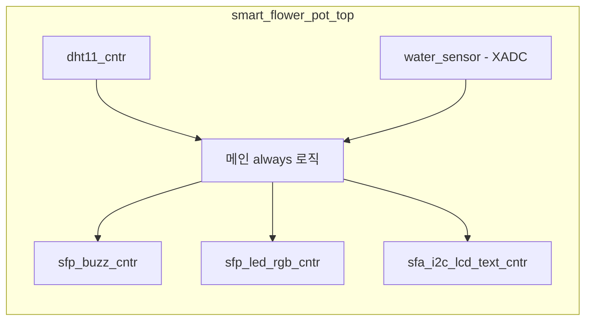
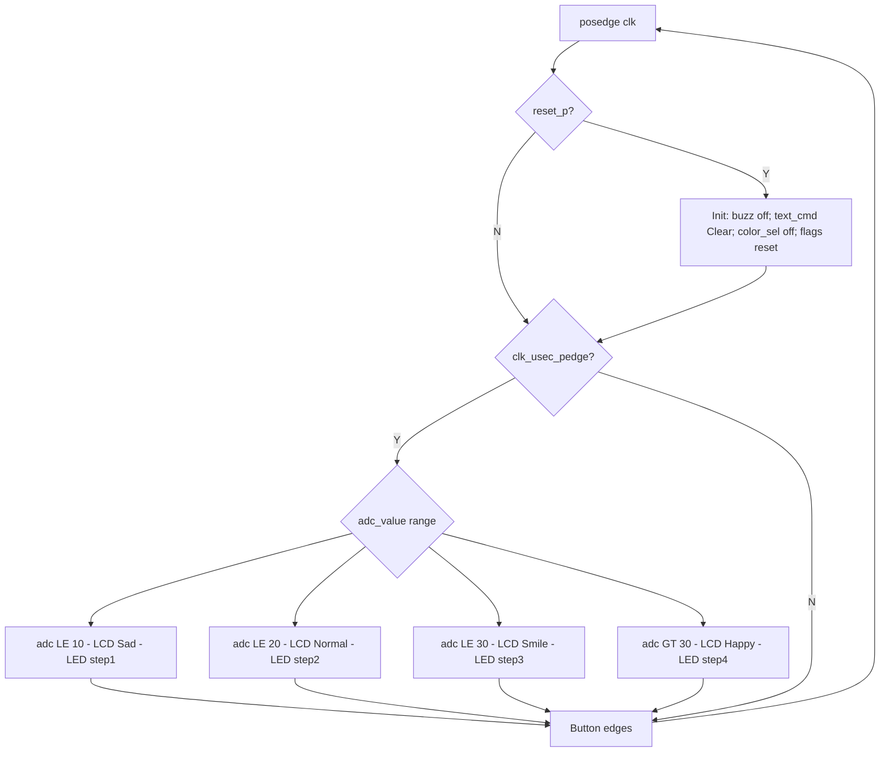
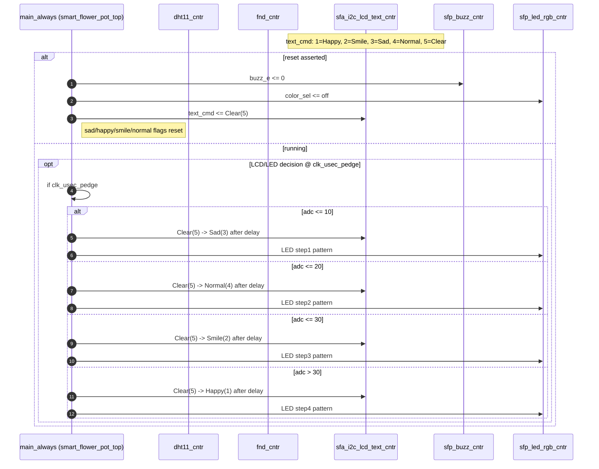

# SmartFlowerPot
스마트 화분 (SmartFlowerPot)  프로젝트 페이지 입니다.  

## 사용자 계정 추가

신종섭 김도연 전길수

## 플로우 차트.

```mermaid
flowchart LR
	%% 모듈 단위 구성 개요 (세미콜론으로 명령 분리)
	subgraph modules[smart_flower_pot_top]
		direction TB
		dht[dht11_cntr ]
		water[water_sensor - XADC]
	main[메인 always 로직]
		buzzer[sfp_buzz_cntr]
		rgb[sfp_led_rgb_cntr]
		lcd[sfa_i2c_lcd_text_cntr]
	end

	%% 데이터/제어 흐름 (고수준)
	dht --> main
	water --> main
	main --> buzzer
	main --> rgb
	main --> lcd
```

```mermaid
flowchart TD
	%% 메인 always 로직 기반 순서차트 (고수준)
	A[posedge clk] --> B{reset_p?}
	B -- Y --> C[Init: buzz off; text_cmd Clear; color_sel off; flags reset]
	B -- N --> G{clk_usec_pedge?}
	C --> G

	G -- Y --> I{adc_value range}
	I --> I1[adc LE 10 - LCD Sad - LED step1]
	I --> I2[adc LE 20 - LCD Normal - LED step2]
	I --> I3[adc LE 30 - LCD Smile - LED step3]
	I --> I4[adc GT 30 - LCD Happy - LED step4]

	I1 --> H
	I2 --> H
	I3 --> H
	I4 --> H

	G -- N --> H[Button edges]
	H --> A
```

## 시퀀스 다이어그램

```mermaid
sequenceDiagram
    autonumber
    participant Main as main_always (smart_flower_pot_top)
    participant DHT as dht11_cntr
    participant FND as fnd_cntr
    participant LCD as sfa_i2c_lcd_text_cntr
    participant BUZZ as sfp_buzz_cntr
    participant RGB as sfp_led_rgb_cntr
    

    Note over LCD: text_cmd: 1=Happy, 2=Smile, 3=Sad, 4=Normal, 5=Clear

    alt reset asserted
        Main->>BUZZ: buzz_e <= 0
        Main->>RGB: color_sel <= off
        Main->>LCD: text_cmd <= Clear(5)
        Note right of Main: sad/happy/smile/normal flags reset
    else running
        

        opt LCD/LED decision @ clk_usec_pedge
            Main->>Main: if clk_usec_pedge
            alt adc <= 10
                Main->>LCD: Clear(5) -> Sad(3) after delay
                Main->>RGB: LED step1 pattern
            else adc <= 20
                Main->>LCD: Clear(5) -> Normal(4) after delay
                Main->>RGB: LED step2 pattern
            else adc <= 30
                Main->>LCD: Clear(5) -> Smile(2) after delay
                Main->>RGB: LED step3 pattern
            else adc > 30
                Main->>LCD: Clear(5) -> Happy(1) after delay
                Main->>RGB: LED step4 pattern
            end
        end
    end
```

